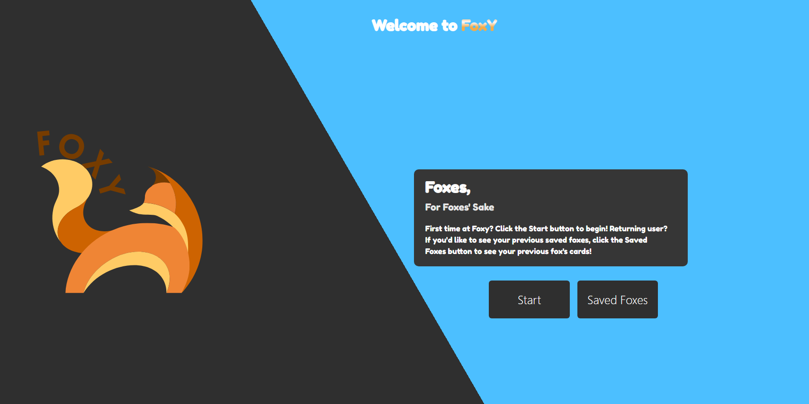
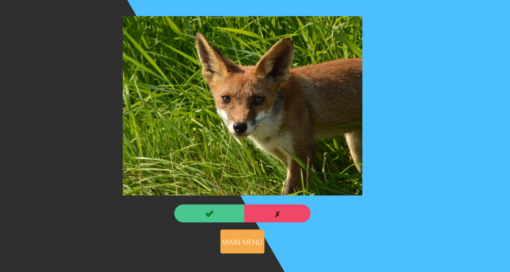
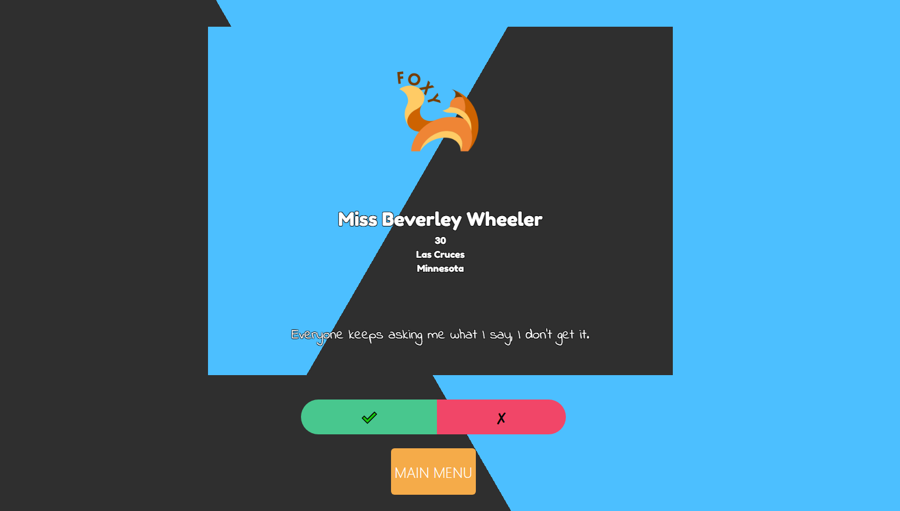
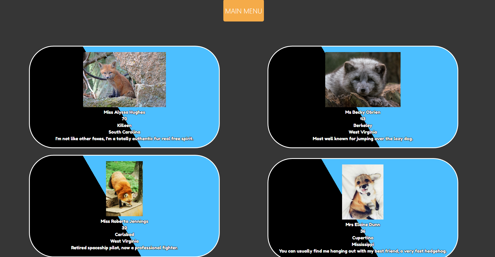

# Foxy

Foxy is a site that lets you curate a list of foxes with assigned names/homes/bios and other information. 

## Using Foxy

Upon starting Foxy, you'll be greeted with a starting page that includes instructions to use Foxy. There are two buttons under the instructions. The Start button will begin the process of seeing foxes generated by the application. 

After clicking start, you'll be shown an image of a fox. Hover your mouse over the image, and the image will flip, revealing the reverse side of the card that includes information about the fox, including name, age, location, and a short bio. Underneath the card, there is a pair of buttons, a check and an x. If you'd like to save the card to review at a later time, click the check button. To move onto the next fox without saving, click the x. Under the check and x buttons is a button to return to the starting page.

From the home screen, clicking Saved Foxes will bring you to a page that has a list of the foxes you've previously saved, including a thumbnail of their picture along with the information that was displayed on the flipside of their card. A Main Menu botton is at the top of this list, clicking it will return you to the front page where you can choose to save additional foxes.

## Technologies used

Foxy was built using HTML, CSS, JavaScript, and the Bulma CSS framework. 

Images for foxes are provided by the [Random Fox API.](https://randomfox.ca/)

Information for fox details is generated by the [Random User API.](https://randomuser.me/)

# Credits/Links

Foxy was developed by Cory Hall, Joel Hauser, and Austin Carter.

The GitHub repo can be found [here](https://github.com/auscarter17/Foxy).

The live application can be found [here](https://auscarter17.github.io/Foxy/).

